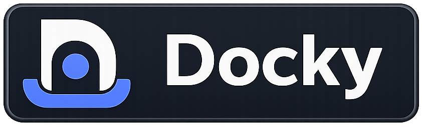
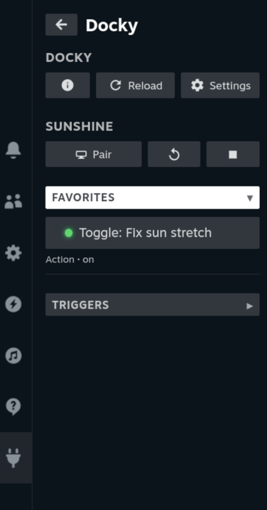
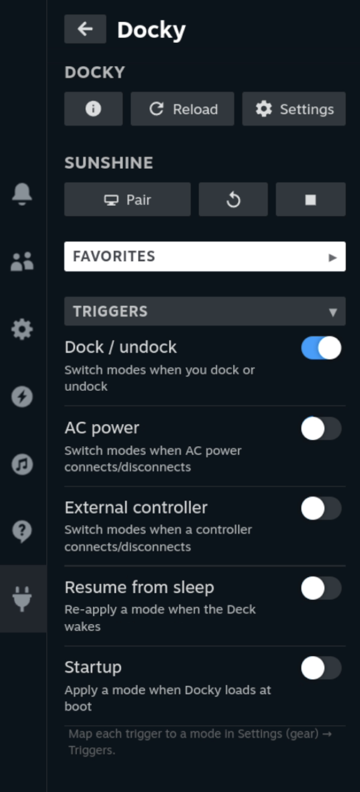
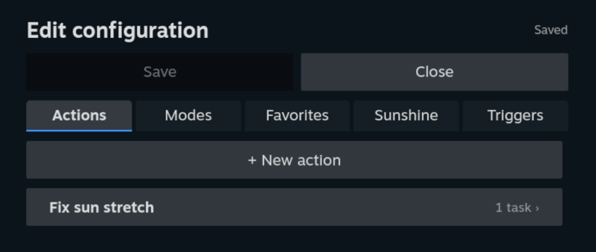
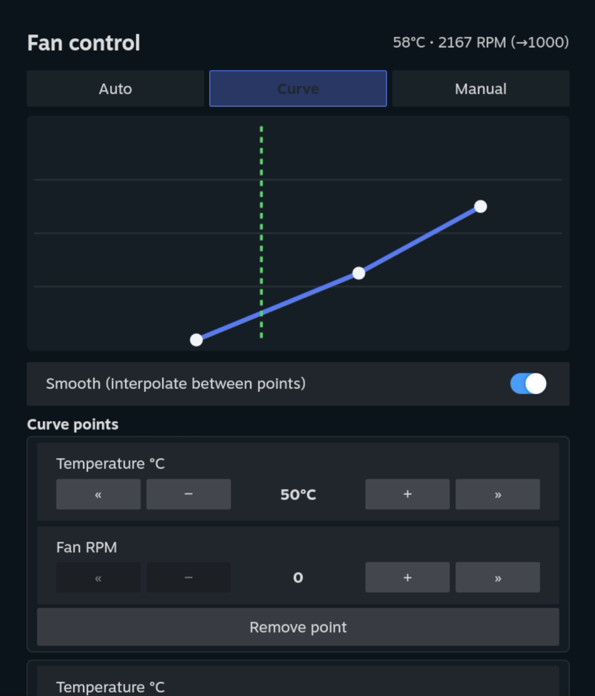
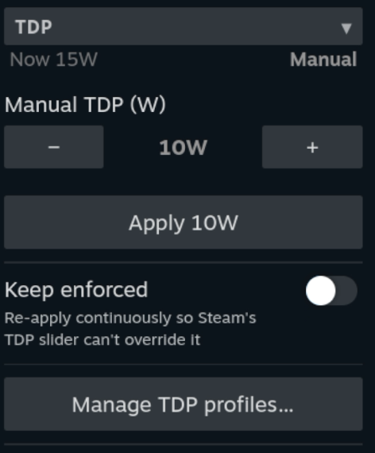
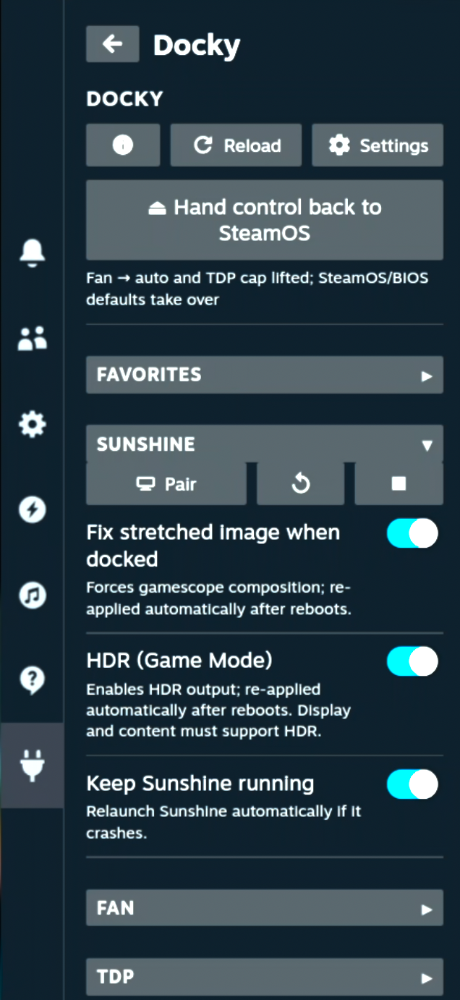
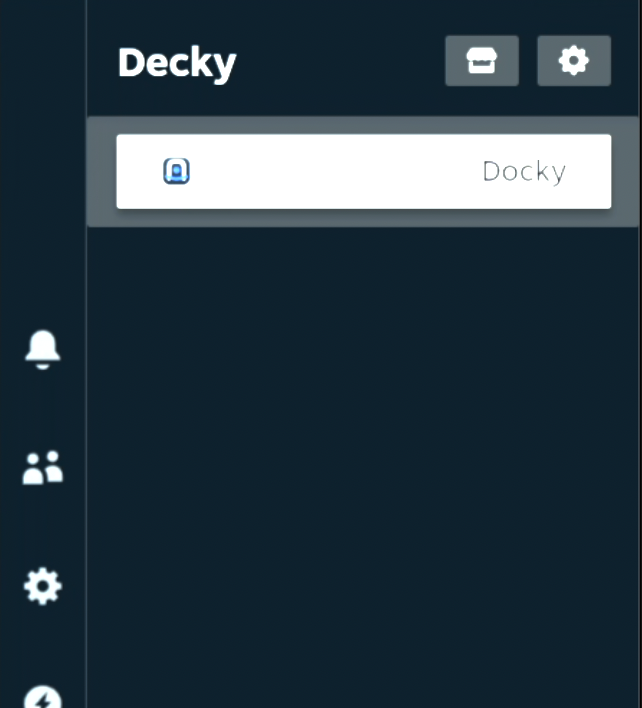

<p align="center">
  
</p>

# Docky

**Steam Deck automation, driven entirely from Game Mode.** Docky is a
[Decky Loader](https://decky.xyz/) plugin that runs **Actions** when something
happens — you dock, unplug AC, connect a controller, wake from sleep, or boot —
and ships built-in fixes for the common docked-mode annoyances (audio not
switching, the controller-order shuffle, the docked stretch/blur, performance).
It also fully manages [Sunshine](https://github.com/LizardByte/Sunshine) game
streaming.

Everything is built and edited in the Quick Access panel — no config files, no
Desktop Mode required.

<p align="center">
  
</p>

```
Task   — one atomic operation (a built-in fix, a file op, or run a script/binary)
Action — an ordered list of Tasks
Mode   — a named set of Actions, activated manually or by a Trigger
Trigger— an event (dock/undock, AC, controller, resume, startup) → a Mode
```

---

## Highlights

- **Triggers** — run a Mode automatically on dock/undock, AC connect/disconnect,
  external-controller connect/disconnect, resume-from-sleep, or startup.
- **Built-in dock fixes** — switch audio output, disable the built-in controller
  so an external pad is Player 1, and force gamescope composition (the docked
  stretch fix) — all as one-tap tasks.
- **Fan & TDP control** — a temperature → RPM fan **curve** (with a live graph),
  manual RPM, or auto; an APU **TDP** cap with optional continuous enforcement;
  reusable **fan/TDP profiles** you can apply from the panel, a task, or a Mode;
  and a one-tap **"hand control back to SteamOS"**. See
  [Performance](docs/performance.md).
- **Favorites** — pin the actions/modes you use most to the panel; stateful ones
  (like force-composition) show a live on/off LED.
- **Sunshine** — install/update from Flathub, start/stop/restart, set the
  encoder, force composition, toggle Game-Mode **HDR**, and pair/manage Moonlight
  clients — or defer to the `decky-sunshine` plugin (auto-detected). A **watchdog**
  relaunches it if it crashes **and rebuilds its screen capture if it can't grab the
  display** — the docked-boot / resume / dock-change *"Error 503"* — and Docky keeps
  it **discoverable** (self-healing mDNS) so Moonlight finds the Deck after a reboot
  instead of showing it offline.
- **In-Game-Mode editor** — build Actions, Modes, Favorites, Triggers, and
  Sunshine settings from the gear menu; nothing persists until you Save.

## Screenshots

<table>
  <tr>
    <td valign="top" align="center">
      <br>
      <sub>Triggers — run a Mode on dock / AC / controller / resume / startup</sub>
    </td>
    <td valign="top" align="center">
      <br>
      <sub>In-Game-Mode editor (Actions / Modes / Favorites / Sunshine / Triggers)</sub>
    </td>
  </tr>
  <tr>
    <td valign="top" align="center">
      <br>
      <sub>Sunshine — engine selection, version, install/update</sub>
    </td>
    <td valign="top" align="center">
      <br>
      <sub>Moonlight pairing & paired-device management</sub>
    </td>
  </tr>
  <tr>
    <td valign="top" align="center">
      <br>
      <sub>Fan control — Auto / Curve / Manual, live temp·RPM, editable curve</sub>
    </td>
    <td valign="top" align="center">
      <br>
      <sub>TDP — manual watts, "keep enforced", profiles</sub>
    </td>
  </tr>
  <tr>
    <td valign="top" align="center">
      <br>
      <sub>Sunshine — start/pair, composition, HDR, keep-alive</sub>
    </td>
    <td valign="top" align="center">
      <br>
      <sub>Docky in the Decky menu (Quick Access → Decky)</sub>
    </td>
  </tr>
</table>

## Install

Decky Loader must already be installed. Do this from Game Mode.

### Install from URL (easiest — good for testing)

In Decky: **gear** (Settings) → turn on **Developer mode** → the **Developer**
section → **Install Plugin from URL**, and paste:

```
https://github.com/datbird/docky/releases/latest/download/Docky.zip
```

That link always points at the newest release, so it stays current. No terminal,
no toolchain.

### Install from source

```bash
git clone https://github.com/datbird/docky.git
cd docky
sudo ./install.sh
```

Re-run `install.sh` to update; `./uninstall.sh` to remove (your config is
preserved). The frontend bundle (`dist/index.js`) is committed, so a fresh clone
needs **no Node toolchain**. This path also installs the Desktop-Mode Steam
autostart fix (see [Sunshine](docs/sunshine.md)), which the URL install does not.

Then: Game Mode → Quick Access (•••) → Decky → **Docky**.

## Quick start — a docked/handheld setup

1. Open Docky → **gear** (Settings) → **Modes** → **+ New mode**, name it
   `Docked`. Repeat for `Handheld`.
2. **Actions** → **+ New action** → add tasks, e.g. for `Docked`:
   *Audio: HDMI*, *Controller: Off (external is P1)*, *Sunshine: force
   composition → On*. Make a `Handheld` action with the inverse.
3. Assign each action to its mode (Modes tab → toggle the action on).
4. **Triggers** tab → set **When docked → `Docked`**, **When undocked →
   `Handheld`**. **Save.**
5. Back in the panel → **Triggers** section → turn on **Dock / undock**.

Dock the Deck and the `Docked` mode runs automatically. Pin either mode as a
**Favorite** for a one-tap manual switch.

## Documentation

| Guide | Covers |
|---|---|
| [Concepts](docs/concepts.md) | Tasks → Actions → Modes → Triggers → Favorites |
| [Task reference](docs/tasks.md) | Every task type, its fields, and examples |
| [Performance](docs/performance.md) | Fan curve/manual, TDP cap + enforcement, profiles |
| [Triggers](docs/triggers.md) | All triggers, dock detection, mode mapping |
| [Sunshine](docs/sunshine.md) | Engine selection, install/update, pairing, encoder, composition, HDR, watchdog & discovery |
| [Streaming ⇄ Desktop](docs/gpu-coexistence.md) | Why Moonlight (Sunshine) and Desktop-Mode RDP share one GPU, and how the handoff + Steam wrapper let you move between them |
| [Configuration](docs/configuration.md) | `config.json` / `state.json` reference |
| [Troubleshooting](docs/troubleshooting.md) | Common issues and fixes |
| [Design notes](docs/design-notes.md) | Accepted trade-offs & known limitations, with rationale |
| [Development](docs/development.md) | Architecture, build/dev loop, deploy |

## Permissions

Docky's backend runs as **root** (`plugin.json` `flags: ["root"]`) — most of what
it does (system services, protected paths, managing other processes, the
streaming-capture helper) needs it. Files created by file-op tasks are chowned
back to their parent directory's owner so user-space can still read/edit them.
Script/command tasks therefore run as root; treat your config like a root cron.
See [Configuration → Security](docs/configuration.md#security) for details.

## Contributing

Build and dev workflow are in [docs/development.md](docs/development.md); PR notes
in [CONTRIBUTING.md](CONTRIBUTING.md). Issues and PRs welcome.

## License

[MIT](LICENSE) © datbird
