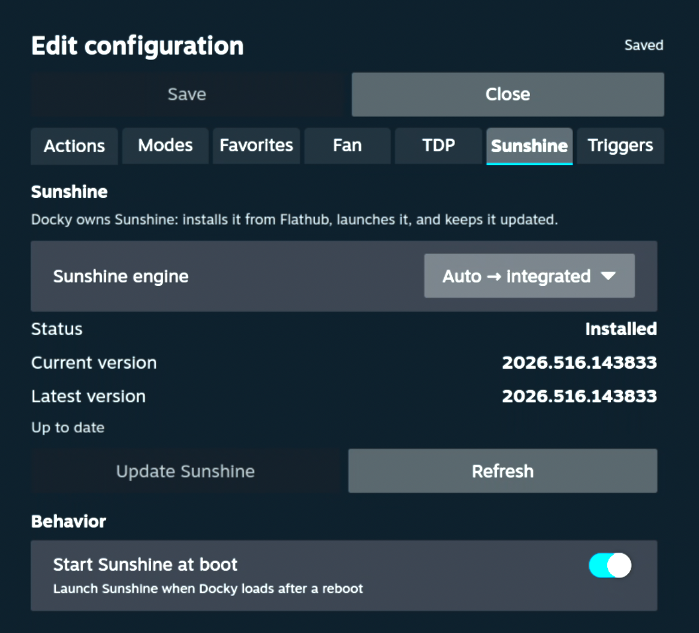
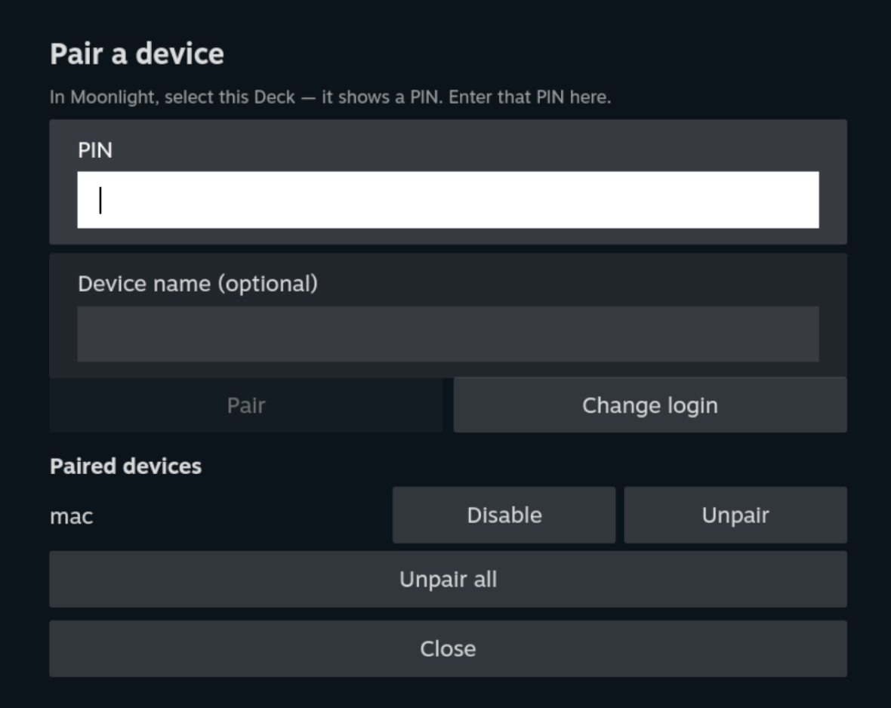

# Sunshine

Docky can fully manage [Sunshine](https://github.com/LizardByte/Sunshine) — the
LizardByte game-streaming host — from Game Mode, or defer to the
[`decky-sunshine`](https://github.com/s0t7x/decky-sunshine) plugin if you prefer
it. Both manage the **same** Sunshine flatpak (`dev.lizardbyte.app.Sunshine`),
which is why Docky's non-launch tasks work either way.

## Engine selection

**gear → Sunshine → Sunshine engine.** Default is **Auto**:

| Engine | Behavior |
|---|---|
| **Auto** | Detect: `decky-sunshine` installed → use it; else the Sunshine flatpak installed → **Integrated**; else **Off** (not set up). |
| **Integrated** | Docky owns Sunshine — install, autostart, launch, update. |
| **decky-sunshine** | Defer lifecycle to that plugin. Docky's other Sunshine tasks (stop, encoder, composition, pairing) still work on the shared flatpak. |
| **Off** | Docky ignores Sunshine entirely. |

> If you pick **Integrated** while `decky-sunshine` is also installed, both may
> try to launch Sunshine and fight over the streaming port. Use **Auto**
> (recommended) or disable `decky-sunshine`'s autostart.

### Install scenarios

- **Fresh Deck, no Sunshine** → Auto resolves to **Off**; the Sunshine tab shows
  "not set up" with an **Install & enable** button that pulls it from Flathub.
- **Sunshine flatpak already installed** (system or per-user) → **Integrated**.
- **`decky-sunshine` installed** → auto-detected, "just works," no port conflict.

## Install & update

In **Integrated** mode the Sunshine tab shows the current vs. latest version
(from Flathub) and an **Install & enable** / **Update** button. Update detection
compares commits, not just version strings. (In `decky-sunshine` mode these are
managed there instead.)

Docky adds the flathub **system** remote if missing, then installs from it
explicitly, so a clean machine doesn't depend on remote state another tool left
behind.

## Start at boot

The **Start Sunshine at boot** toggle (gear → Sunshine → Behavior) launches
Sunshine when Docky loads, so streaming is available after a reboot without
opening the panel. Only applies in Integrated mode (decky-sunshine handles its
own autostart).

## Pairing Moonlight clients

Panel → **Pair** (enabled once Sunshine is running). The Pair modal:

1. **Set a login** if none is stored — Docky takes ownership of Sunshine's admin
   credentials (this resets the username/password; **existing paired devices are
   kept**).
2. In Moonlight, select the Deck — it shows a PIN.
3. Enter the PIN in Docky. Paired devices are listed with per-device
   **Enable/Disable** and **Unpair**, plus **Unpair all**.

A **disabled** device stays paired but can't connect until re-enabled.

## Encoder

The `sunshine_encoder` task (or the editor) sets Sunshine's video encoder:
`` (auto), `vaapi` (recommended on the Deck's AMD GPU), `vulkan`, or `software`.
Sunshine reads its config at launch, so the change applies on the next start.

## Composition (the docked stretch fix)

When docked to an external display, gamescope can drop to direct scanout and the
captured stream looks stretched/blurry. The `sunshine_composition` task forces
gamescope composition via the `GAMESCOPE_COMPOSITE_FORCE` root-window atom:

- `on` — force composition (the fix)
- `off` — release it (gamescope *may* scan out directly again)
- `toggle` — flip the current value

Note: `off` is *permissive*, not "force direct scanout" — the stretch only
returns when gamescope actually drops to scanout, which won't happen if anything
is compositing (an open overlay, the QAM, etc.). The composition fix is also
gamescope-version-sensitive; it's the standard workaround but not guaranteed on
every build.

The **"Fix stretched image when docked"** panel toggle persists this as a
preference. Because `GAMESCOPE_COMPOSITE_FORCE` is runtime-only (it resets every
reboot and on resume-from-sleep), Docky re-applies the preference automatically:
it retries at boot until gamescope's display is actually ready — so a boot race
can't silently leave the image stretched — and a lightweight watchdog reasserts
it for the whole session, so it also self-heals after sleep and display changes.
You therefore don't need a Resume-trigger Mode just to re-apply composition;
mapping Resume is still useful for *other* tasks (e.g. re-selecting audio output).

## HDR (Game Mode)

The **HDR (Game Mode)** panel toggle (and the `sunshine_hdr` task) turns
gamescope's HDR output on or off:

- `on` — enable HDR output
- `off` — disable it
- `toggle` — flip the current value

The toggle reflects the **live** HDR state, and because the underlying gamescope
HDR atom is runtime-only (it resets every reboot and on resume), Docky remembers
the preference and self-heals it — retrying at boot until the display is ready
and reasserting it every session via the same watchdog as composition.

HDR only *does* anything when the whole chain is HDR-ready: an HDR-capable display
(docked), **Steam → Settings → Display → HDR** enabled, and, for a stream, an
HDR-capable Moonlight client with HDR + the **HEVC** codec selected. If Steam's
own HDR setting is off, gamescope isn't emitting HDR and the toggle correctly
shows **off** — it's reporting reality, not out of sync.

## Staying up and discoverable

Two things keep a Docky-owned (Integrated) Sunshine reachable without you having
to babysit it:

- **Watchdog** — the **Keep Sunshine running** toggle (on by default) relaunches
  Sunshine automatically if it crashes, so a streaming host failure recovers on
  its own. It also heals a subtler failure: Sunshine can stay *running* yet be
  unable to capture the screen, so Moonlight connects but every stream fails with
  **"Error 503: Failed to initialize video capture/encoding"**. Sunshine builds its
  capture pipeline once, at launch, and never rebuilds it, so this happens whenever
  the display wasn't ready at that moment — a **docked boot** (the external panel
  hadn't come up yet), a **resume-from-sleep**, or a **dock/undock** that swapped
  the active display. Docky detects it from Sunshine's own capture probe (and
  notices dock/undock directly) and restarts Sunshine to rebuild the pipeline
  against the current display, usually within ~15 seconds. It honors an explicit
  **Stop** from the panel, is debounced and rate-limited so it can't thrash, only
  acts when a display is actually lit, and never interrupts a live stream.
- **Self-healing discovery (mDNS)** — Moonlight finds the Deck by browsing for
  Sunshine's `_nvstream` mDNS record and by resolving `<host>.local`, both served
  by avahi. SteamOS ships avahi installed but with **publishing disabled**, and
  Sunshine only registers its record once at startup — so on a fresh boot (where
  Sunshine can start before avahi is ready) or after avahi restarts (a system
  update, a DHCP/network change) the record silently vanishes and Moonlight shows
  the Deck as **offline** even though Sunshine is fine. Docky handles this
  automatically: it enables avahi publishing, verifies after startup that the
  record actually landed, and runs a lightweight watchdog that re-registers within
  seconds if it ever disappears. It never interrupts a live stream. No setting —
  it just works.

  > If Moonlight still can't find the Deck, add it by **IP** as a fallback
  > (pairing survives, so you won't need to re-pair) — but this should be rare now
  > that discovery self-heals.
